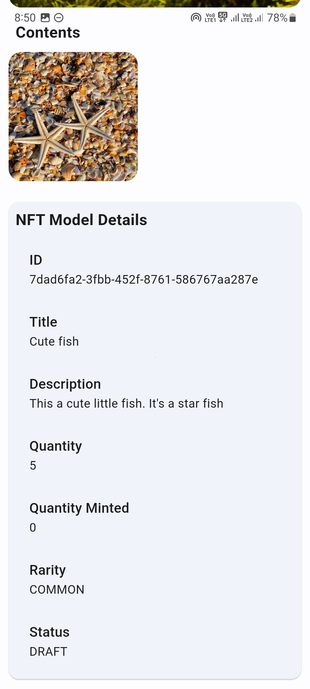

# N-Fungible (Niftory)
N-Fungible (Niftory) is a simple dApp using Niftory API for managing NFTs.

### Description
N-Fungible (Niftory) is a simple dApp that uses Niftory API for creating NFTs and managing it. This is a flutter-based application. It is a free to use application.
  <b>Upcoming features:</b>
- Ability to manage Niftory wallets

---
## Screenshots

|  |  |
| --------------------------- | --------------------------- |
|  |  |

This project is a part of [Flow Hackathon](https://hackathon.flow.com/).